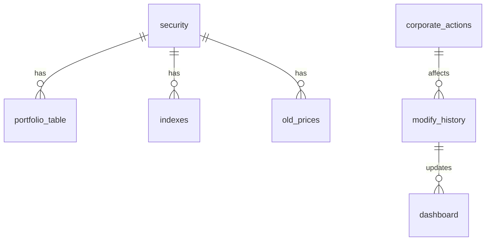

# Database Schema Documentation

This document provides a comprehensive overview of all database tables used in the Portfolio Allocation Tool.

## Database: `pf_allocation`

The application uses a MySQL database named `pf_allocation` to store portfolio data, stock information, corporate actions, and historical data.

---

## Table: `security`

**Purpose**: Stores basic information about securities/stocks in the portfolio.

### Structure
```sql
CREATE TABLE IF NOT EXISTS security (
    id INT AUTO_INCREMENT PRIMARY KEY,
    security_name VARCHAR(255) NOT NULL,
    sector VARCHAR(100),
    is_active BOOLEAN DEFAULT 1
);
```

### Columns
| Column | Type | Description |
|--------|------|-------------|
| `id` | INT AUTO_INCREMENT | Primary key, unique identifier |
| `security_name` | VARCHAR(255) | Full name of the security/stock |
| `sector` | VARCHAR(100) | Industry sector (e.g., Power, Energy) |
| `is_active` | BOOLEAN | Whether the security is currently active (default: 1) |

### Sample Data
```sql
INSERT INTO security (security_name, sector) VALUES
('NTPC Ltd', 'Power'),
('Adani Power Ltd', 'Power'),
('Tata Power Co Ltd', 'Power');
```

---

## Table: `portfolio_table`

**Purpose**: Links securities to portfolio holdings with additional metadata.

### Structure
```sql
CREATE TABLE IF NOT EXISTS portfolio_table (
    id INT AUTO_INCREMENT PRIMARY KEY,
    stock_id INT NOT NULL,
    notes TEXT,
    date_added DATETIME DEFAULT CURRENT_TIMESTAMP,
    is_active BOOLEAN DEFAULT 1,
    FOREIGN KEY (stock_id) REFERENCES security(id)
);
```

### Columns
| Column | Type | Description |
|--------|------|-------------|
| `id` | INT AUTO_INCREMENT | Primary key |
| `stock_id` | INT | Foreign key to `security.id` |
| `notes` | TEXT | Additional notes about the holding |
| `date_added` | DATETIME | When the security was added to portfolio |
| `is_active` | BOOLEAN | Whether the holding is active |

---

## Table: `indexes`

**Purpose**: Stores index weight data for securities on specific dates.

### Structure
```sql
CREATE TABLE IF NOT EXISTS indexes (
    id INT AUTO_INCREMENT PRIMARY KEY,
    date DATE NOT NULL,
    weight DECIMAL(10,2) NOT NULL,
    security_id INT,
    security_name VARCHAR(255) NOT NULL,
    FOREIGN KEY (security_id) REFERENCES security(id)
);
```

### Columns
| Column | Type | Description |
|--------|------|-------------|
| `id` | INT AUTO_INCREMENT | Primary key |
| `date` | DATE | Date of the index weight |
| `weight` | DECIMAL(10,2) | Index weight percentage |
| `security_id` | INT | Foreign key to `security.id` (optional) |
| `security_name` | VARCHAR(255) | Security name (for direct reference) |

### Sample Data
```sql
INSERT INTO indexes (date, weight, security_name) VALUES
('2024-01-15', 15.50, 'NTPC Ltd'),
('2024-01-15', 12.30, 'Adani Power Ltd');
```

---

## Table: `modify_history`

**Purpose**: Tracks all portfolio modifications and changes with detailed calculations.

### Structure
```sql
CREATE TABLE IF NOT EXISTS modify_history (
    id INT AUTO_INCREMENT PRIMARY KEY,
    security_name VARCHAR(255) NOT NULL,
    sector VARCHAR(100),
    current_price DECIMAL(10,2),
    index_weight DECIMAL(10,2),
    index_shares INT,
    index_price_per_share DECIMAL(10,2),
    index_price DECIMAL(10,2),
    analyst_weight DECIMAL(10,2),
    analyst_shares INT,
    analyst_price_per_share DECIMAL(10,2),
    analyst_price DECIMAL(10,2),
    analyst_stance VARCHAR(50),
    notes TEXT,
    date_added DATETIME DEFAULT CURRENT_TIMESTAMP
);
```

### Columns
| Column | Type | Description |
|--------|------|-------------|
| `id` | INT AUTO_INCREMENT | Primary key |
| `security_name` | VARCHAR(255) | Name of the security |
| `sector` | VARCHAR(100) | Industry sector |
| `current_price` | DECIMAL(10,2) | Current market price |
| `index_weight` | DECIMAL(10,2) | Weight in the index (%) |
| `index_shares` | INT | Number of shares based on index weight |
| `index_price_per_share` | DECIMAL(10,2) | Price per share for index allocation |
| `index_price` | DECIMAL(10,2) | Total value based on index weight |
| `analyst_weight` | DECIMAL(10,2) | Analyst's recommended weight (%) |
| `analyst_shares` | INT | Number of shares based on analyst weight |
| `analyst_price_per_share` | DECIMAL(10,2) | Price per share for analyst allocation |
| `analyst_price` | DECIMAL(10,2) | Total value based on analyst weight |
| `analyst_stance` | VARCHAR(50) | Analyst recommendation (Buy/Hold/Sell) |
| `notes` | TEXT | Additional notes |
| `date_added` | DATETIME | When the modification was made |

### Calculations
- **Index Shares**: `index_price / current_price`
- **Analyst Shares**: `analyst_price / current_price`
- **Index Price**: `index_weight / total_index_weight * total_investment`
- **Analyst Price**: `analyst_weight / total_index_weight * total_investment`

---

## Table: `old_prices`

**Purpose**: Stores historical price data for securities.

### Structure
```sql
CREATE TABLE IF NOT EXISTS old_prices (
    id INT AUTO_INCREMENT PRIMARY KEY,
    security_id INT NOT NULL,
    price DECIMAL(10,2) NOT NULL,
    recorded_at DATETIME DEFAULT CURRENT_TIMESTAMP,
    FOREIGN KEY (security_id) REFERENCES security(id)
);
```

### Columns
| Column | Type | Description |
|--------|------|-------------|
| `id` | INT AUTO_INCREMENT | Primary key |
| `security_id` | INT | Foreign key to `security.id` |
| `price` | DECIMAL(10,2) | Historical price value |
| `recorded_at` | DATETIME | When the price was recorded |

---

## Table: `corporate_actions`

**Purpose**: Tracks corporate actions like dividends, bonus issues, and stock splits.

### Structure
```sql
CREATE TABLE IF NOT EXISTS corporate_actions (
    id INT AUTO_INCREMENT PRIMARY KEY,
    security_name VARCHAR(255) NOT NULL,
    action_type VARCHAR(100) NOT NULL,
    value VARCHAR(255),
    ex_date DATE,
    record_date DATE,
    payment_date DATE,
    current_price DECIMAL(10,2),
    shares BIGINT,
    impact VARCHAR(255),
    notes TEXT,
    created_at DATETIME DEFAULT CURRENT_TIMESTAMP
);
```

### Columns
| Column | Type | Description |
|--------|------|-------------|
| `id` | INT AUTO_INCREMENT | Primary key |
| `security_name` | VARCHAR(255) | Name of the security |
| `action_type` | VARCHAR(100) | Type of action (Dividend, Bonus Issue, Face Value Split) |
| `value` | VARCHAR(255) | Value of the action (e.g., "₹5.50 per share", "2:1") |
| `ex_date` | DATE | Ex-dividend date |
| `record_date` | DATE | Record date for eligibility |
| `payment_date` | DATE | Date when action is executed |
| `current_price` | DECIMAL(10,2) | Current stock price |
| `shares` | BIGINT | Number of shares affected |
| `impact` | VARCHAR(255) | Calculated impact description |
| `notes` | TEXT | Additional notes |
| `created_at` | DATETIME | When the record was created |

### Sample Data
```sql
INSERT INTO corporate_actions (security_name, action_type, value, ex_date, record_date, payment_date, current_price, shares, impact) VALUES
('NTPC Ltd', 'Dividend', '₹5.50 per share', '2025-06-23', '2025-06-24', '2025-07-01', 348.45, 83859317, '₹461,226,243.50'),
('Power Grid Corporation of India Ltd', 'Bonus Issue', '1:3', '2025-07-09', '2025-07-10', '2025-07-15', 303.95, 73704877, '+24,568,292 shares');
```

---

## Table: `dashboard`

**Purpose**: Stores current dashboard data for quick access and display.

### Structure
```sql
CREATE TABLE IF NOT EXISTS dashboard (
    id INT AUTO_INCREMENT PRIMARY KEY,
    aID VARCHAR(50),
    date DATE,
    security_name VARCHAR(255) NOT NULL,
    current_price DECIMAL(10,2),
    index_weight DECIMAL(10,2),
    analyst_weight DECIMAL(10,2),
    analyst_stance VARCHAR(50),
    index_price DECIMAL(10,2),
    index_no_shares INT,
    index_price_as_per_share_units DECIMAL(10,2),
    analyst_price DECIMAL(10,2),
    analyst_no_shares INT,
    analyst_price_as_per_share_unit DECIMAL(10,2),
    created_at DATETIME DEFAULT CURRENT_TIMESTAMP
);
```

### Columns
| Column | Type | Description |
|--------|------|-------------|
| `id` | INT AUTO_INCREMENT | Primary key |
| `aID` | VARCHAR(50) | Analyst ID |
| `date` | DATE | Date of the data |
| `security_name` | VARCHAR(255) | Name of the security |
| `current_price` | DECIMAL(10,2) | Current market price |
| `index_weight` | DECIMAL(10,2) | Index weight percentage |
| `analyst_weight` | DECIMAL(10,2) | Analyst weight percentage |
| `analyst_stance` | VARCHAR(50) | Analyst recommendation |
| `index_price` | DECIMAL(10,2) | Calculated index price |
| `index_no_shares` | INT | Number of shares for index allocation |
| `index_price_as_per_share_units` | DECIMAL(10,2) | Index price in share units |
| `analyst_price` | DECIMAL(10,2) | Calculated analyst price |
| `analyst_no_shares` | INT | Number of shares for analyst allocation |
| `analyst_price_as_per_share_unit` | DECIMAL(10,2) | Analyst price in share units |

---

## Table: `modify_list_update_history`

**Purpose**: Tracks portfolio performance and gains over time.

### Structure
```sql
CREATE TABLE IF NOT EXISTS modify_list_update_history (
    id INT AUTO_INCREMENT PRIMARY KEY,
    date DATE NOT NULL,
    aID VARCHAR(50),
    security_names TEXT,
    total_index_value DECIMAL(15,2),
    index_gain DECIMAL(15,2),
    analyst_gain DECIMAL(15,2),
    index_gain_percentage DECIMAL(10,2),
    analyst_gain_percentage DECIMAL(10,2),
    analyst_performance_difference DECIMAL(10,2),
    created_at DATETIME DEFAULT CURRENT_TIMESTAMP
);
```

### Columns
| Column | Type | Description |
|--------|------|-------------|
| `id` | INT AUTO_INCREMENT | Primary key |
| `date` | DATE | Date of the update |
| `aID` | VARCHAR(50) | Analyst ID |
| `security_names` | TEXT | Comma-separated list of securities |
| `total_index_value` | DECIMAL(15,2) | Total value based on index weights |
| `index_gain` | DECIMAL(15,2) | Absolute gain from index allocation |
| `analyst_gain` | DECIMAL(15,2) | Absolute gain from analyst allocation |
| `index_gain_percentage` | DECIMAL(10,2) | Percentage gain from index |
| `analyst_gain_percentage` | DECIMAL(10,2) | Percentage gain from analyst |
| `analyst_performance_difference` | DECIMAL(10,2) | Difference between analyst and index performance |

---

## Table Relationships



### Key Relationships:
1. **security** → **portfolio_table**: One security can have multiple portfolio entries
2. **security** → **indexes**: One security can have multiple index weight records
3. **security** → **old_prices**: One security can have multiple historical prices
4. **modify_history** → **dashboard**: Portfolio modifications update dashboard data
5. **corporate_actions** → **modify_history**: Corporate actions affect portfolio calculations

---

## Database Setup

### Complete Setup Script
```sql
-- Create database
CREATE DATABASE IF NOT EXISTS pf_allocation;
USE pf_allocation;

-- Create all tables (run the setup_database.sql file)
-- Then add the missing corporate_actions table:

CREATE TABLE IF NOT EXISTS corporate_actions (
    id INT AUTO_INCREMENT PRIMARY KEY,
    security_name VARCHAR(255) NOT NULL,
    action_type VARCHAR(100) NOT NULL,
    value VARCHAR(255),
    ex_date DATE,
    record_date DATE,
    payment_date DATE,
    current_price DECIMAL(10,2),
    shares BIGINT,
    impact VARCHAR(255),
    notes TEXT,
    created_at DATETIME DEFAULT CURRENT_TIMESTAMP
);

-- Create indexes for better performance
CREATE INDEX idx_security_name ON security(security_name);
CREATE INDEX idx_modify_history_date ON modify_history(date_added);
CREATE INDEX idx_corporate_actions_date ON corporate_actions(ex_date);
CREATE INDEX idx_dashboard_date ON dashboard(date);
```

---

## Data Import/Export

### Excel File Format for Corporate Actions
The application supports Excel file uploads with the following columns:
- **Security Name**: Full name of the security
- **Action Type**: Type of corporate action
- **Value**: Value of the action
- **Ex Date**: Ex-dividend date
- **Record Date**: Record date
- **Payment Date**: Payment/execution date

### API Endpoints for Data Management
- `GET /api/portfolio` - Fetch current portfolio data
- `GET /api/corporate-actions` - Fetch corporate actions
- `POST /api/upload-corporate-actions` - Upload corporate actions from Excel
- `POST /api/modify-portfolio` - Modify portfolio allocations

---

## Maintenance and Optimization

### Regular Maintenance Tasks
1. **Archive old data**: Move old records to archive tables
2. **Update prices**: Run daily price updates
3. **Clean up**: Remove inactive securities
4. **Backup**: Regular database backups

### Performance Optimization
1. **Indexes**: Ensure proper indexes on frequently queried columns
2. **Partitioning**: Consider partitioning large tables by date
3. **Cleanup**: Regular cleanup of temporary data
4. **Monitoring**: Monitor query performance and optimize slow queries

---

## Security Considerations

1. **Database Access**: Use dedicated database user with minimal privileges
2. **Connection Security**: Use SSL for database connections
3. **Input Validation**: Validate all user inputs before database operations
4. **SQL Injection**: Use parameterized queries (already implemented)
5. **Backup Security**: Secure database backups with encryption

---

*This documentation should be updated whenever the database schema changes.* 